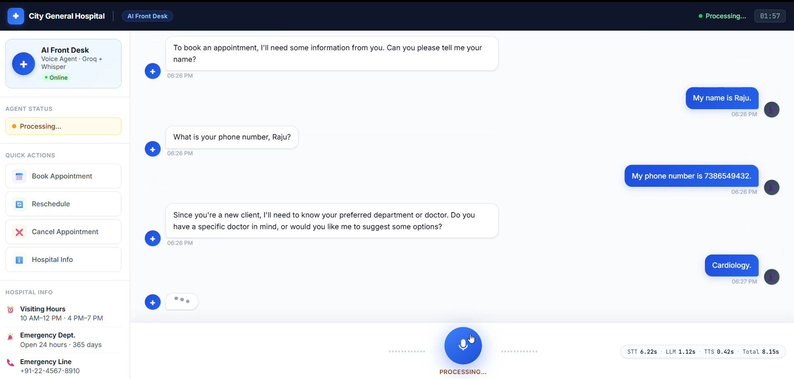
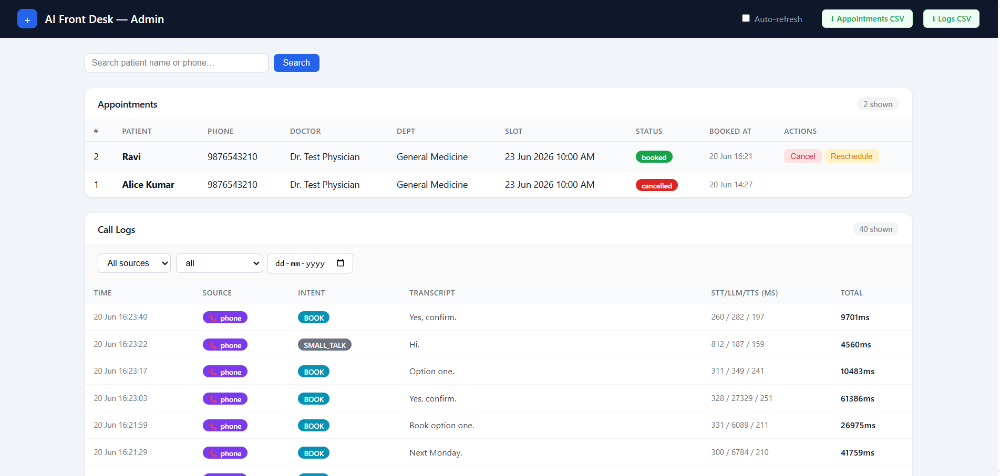
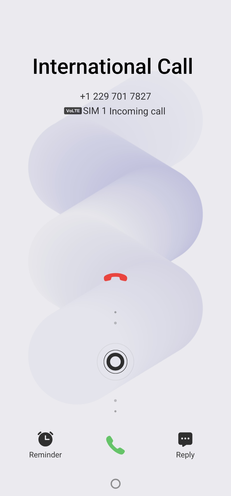
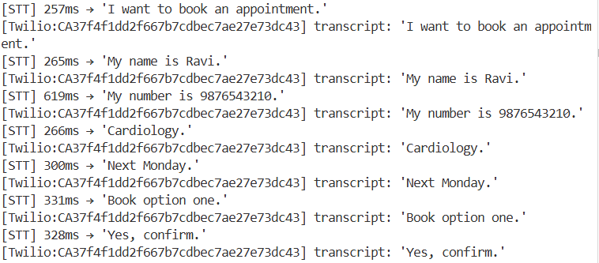

# AI Front Desk — Voice AI Agent for Hospital Appointment Booking


A real-time voice AI receptionist for City General Hospital. Patients speak to book, reschedule, or cancel appointments — **over a browser microphone or a real phone call (Twilio)**. Same LLM agent handles both channels.

```
Patient calls Twilio number → hears greeting → "I want to book an appointment"
→ agent asks name / phone / department / preferred date
→ lists available slots → patient picks one → appointment confirmed in DB

Works identically in browser (push-to-talk orb) and over a real phone call.
```

---

## Demo

https://github.com/user-attachments/assets/0b0dd34d-b6f0-4dd0-9790-9a4b635c47e3

### Browser — push-to-talk voice interface


### Admin dashboard — appointments + call logs


### Real phone call — incoming call on device


> Twilio calls the patient's phone. Agent speaks the greeting within ~2s of pickup.

### Real phone call — 7-turn booking (server logs)


> Complete booking in 7 voice turns — intent → name → phone → department → date → slot → confirm.
> Every turn transcribed correctly. STT latency 257–619ms on real phone audio.

---

## Architecture

Two input channels — same agent core:

```
  BROWSER (Push-to-Talk)              PHONE (Twilio PSTN)
  ──────────────────────              ───────────────────
  Hold orb → speak → release          Patient dials Twilio number
         │                                     │
  MediaRecorder (WebM/Opus)           Twilio Media Stream
         │                            μ-law 8kHz WebSocket frames
  Browser: decode → resample                   │
  → PCM16 16kHz                       Server: μ-law → PCM16 16kHz
         │                            RMS VAD: 600ms silence → turn
         │ WebSocket (binary PCM)              │
         └──────────────┬──────────────────────┘
                        ▼
        ┌───────────────────────────────────────┐
        │         FastAPI Server                │
        │                                       │
        │  Groq Whisper STT  →  transcript      │
        │           │                           │
        │  Intent Classifier (Groq Llama 3)     │
        │           │                           │
        │   ┌───────┼──────────┬──────────┐    │
        │   ▼       ▼          ▼          ▼    │
        │  BOOK  RESCHEDULE   FAQ      SMALL   │
        │  CANCEL             (RAG)    TALK    │
        │   │                  │               │
        │  Groq tool-calling  ChromaDB+BM25    │
        │  (list_doctors,     RRF fusion       │
        │   find_slots,                        │
        │   book/cancel)                       │
        │   │                                  │
        │  SQLite ←──────────────────────────  │
        │  (Doctors, Slots, Appointments,       │
        │   CallLogs with source+latency)       │
        │           │                           │
        │  pyttsx3 TTS  →  WAV bytes            │
        │           │                           │
        └───────────┼───────────────────────────┘
                    │
        ┌───────────┴──────────────┐
        │                          │
   Browser                    Twilio
   WAV streamed                WAV → μ-law 8kHz
   in 4KB chunks               → base64 frames
   Web Audio API plays         → phone earpiece
```

### One voice turn — step by step

```
User holds orb → speaks → releases
        ↓
MediaRecorder captures WebM/Opus  (fresh recorder per press)
        ↓
Browser decodes → resamples to 16kHz Int16 PCM
        ↓
PCM frames sent over WebSocket (binary)
        ↓
Server accumulates → audio_end signal received
        ↓
openai-whisper transcribes PCM → text           (~900ms)
        ↓
Groq LLM classifies intent                      (~100ms)
        ↓
Agent executes (tool calls / RAG retrieval)     (~450ms)
        ↓
pyttsx3 synthesizes speech → WAV bytes          (~220ms)
        ↓
WAV streamed in 4KB chunks → browser plays
        ↓
Total round-trip: ~1.6 seconds  (CPU, no GPU)
```

---

## Features

| Feature | Detail |
|---|---|
| Push-to-talk voice input | Hold orb → speak → release. Fresh `MediaRecorder` per press avoids WebM header eviction bug. |
| Appointment booking | Multi-turn dialog: collects name, phone, department, doctor, date — one question at a time |
| Smart slot search | Numbered options across 14-day window; never says "no slots" without listing alternatives |
| Existing client recognition | Phone lookup → greet by name → offer "same as last time" rebooking |
| Cancellation policy | Blocks cancellations within 24h; agent suggests reschedule instead |
| FAQ via hybrid RAG | ChromaDB (dense) + BM25 (keyword) fused with RRF — visiting hours, insurance, parking, departments |
| Human escalation | "Speak to staff" → amber transfer bubble appears, voice input disabled |
| Barge-in | Speak while agent talks → audio stops instantly, new turn begins |
| Live latency display | STT / LLM / TTS / total shown in UI after every turn |
| Call logging | Every turn logged to SQLite with full latency breakdown |

---

## Stack

| Layer | Technology |
|---|---|
| Backend | FastAPI + uvicorn |
| STT | openai-whisper `base` (self-hosted, offline) |
| LLM | Groq `llama-3.3-70b-versatile` |
| TTS | pyttsx3 (local, zero network cost) |
| RAG | ChromaDB + rank_bm25 + RRF fusion |
| DB | SQLite + SQLAlchemy 2.0 |
| Frontend | Vanilla HTML/JS — WebSocket + Web Audio API |

---

## Project Structure

```
ai-front-desk/
├── app/
│   ├── main.py                    App factory (create_app), lifespan, router mounts
│   ├── config.py                  Settings loaded from .env
│   ├── api/
│   │   ├── deps.py                FastAPI dependency: get_retriever()
│   │   └── routes/
│   │       ├── health.py          GET / and GET /health
│   │       ├── websocket.py       WS /ws/{session_id} + SessionState + turn logic
│   │       ├── telephony.py       POST /twilio/incoming-call + WS /twilio/media-stream/{call_sid}
│   │       └── admin.py           GET /admin dashboard + cancel/reschedule/export endpoints
│   ├── models/
│   │   └── db.py                  SQLAlchemy models: Doctor, Slot, Appointment, CallLog
│   ├── schemas/
│   │   └── appointment.py         Pydantic response schemas
│   ├── services/
│   │   ├── stt.py                 Groq Whisper STT (PCM → transcript)
│   │   ├── tts.py                 pyttsx3 TTS (text → WAV chunks)
│   │   ├── audio_convert.py       μ-law ↔ PCM16 conversion for Twilio
│   │   ├── rag.py                 HybridRetriever: ChromaDB + BM25 + RRF
│   │   └── agent/
│   │       ├── prompts.py         System prompts (INTENT, BOOKING, FAQ, HARD_RULES)
│   │       ├── tools.py           Tool schemas + DB implementations
│   │       ├── intent.py          classify_intent()
│   │       ├── booking.py         run_booking_agent() — tool-calling loop
│   │       └── faq.py             run_faq_agent(), run_small_talk()
│   ├── knowledge_base/            8 markdown files (departments, doctors, FAQ…)
│   └── static/
│       └── index.html             Push-to-talk UI with barge-in and latency panel
├── tests/
│   ├── unit/
│   │   ├── test_audio_convert.py  μ-law/PCM/WAV conversion + VAD RMS tests
│   │   ├── test_intent.py         Intent classification tests (Groq mocked)
│   │   └── test_rag.py            Hybrid retrieval tests (temp ChromaDB)
│   └── integration/
│       └── test_booking.py        Booking/reschedule/cancel tests (in-memory SQLite)
├── scripts/
│   ├── seed_db.py                 Seed 5 doctors + 280 slots
│   ├── seed_rag.py                Chunk + embed knowledge base into ChromaDB
│   ├── latency_report.py          Print avg/p50/p95 latency from call logs
│   └── make_test_call.py          Twilio outbound call: python scripts/make_test_call.py +91XXXXXXXXXX
├── .github/workflows/ci.yml       GitHub Actions CI
├── Dockerfile
├── docker-compose.yml
├── Makefile                       make run / make seed / make test
├── pyproject.toml
├── requirements.txt
├── requirements-dev.txt
├── .env.example
├── LICENSE
└── README.md
```

---

## Setup

### Prerequisites

- Python environment with all dependencies (see `requirements.txt`)
- A free [Groq API key](https://console.groq.com)

### 1. Configure environment

```bash
cp .env.example .env
```

Edit `.env` and set your values:

| Variable | Required | Default | Description |
|---|---|---|---|
| `GROQ_API_KEY` | **Yes** | — | Groq API key from console.groq.com |
| `LLM_MODEL` | No | `llama-3.3-70b-versatile` | Groq model ID |
| `EMBED_MODEL` | No | `all-MiniLM-L6-v2` | Sentence-transformers model for RAG |
| `WHISPER_MODEL` | No | `base` | Whisper model size (`tiny`, `base`, `small`) |
| `CHROMA_PATH` | No | `./chroma_db` | ChromaDB storage path |
| `DATABASE_URL` | No | `sqlite:///./ai_front_desk.db` | SQLAlchemy database URL |
| `CANCELLATION_WINDOW_HOURS` | No | `24` | Hours before appointment within which cancellation is blocked |

### 2. Seed the database

```bash
python scripts/seed_db.py
# Seeded 5 doctors and 280 slots
```

### 3. Seed the RAG knowledge base

```bash
python scripts/seed_rag.py
# Seeded 17 chunks into ChromaDB
```

### 4. Start the server

```bash
uvicorn app.main:app --reload
```

Open [http://localhost:8000](http://localhost:8000) — allow microphone access — hold the orb to speak.

### 5. Run tests

```bash
python -m pytest tests/ -v
# 46/46 pass
```

---

## Telephony Integration (Real Phone Calls)

Call your Twilio number and speak to the same agent that runs in the browser — same booking/FAQ/escalation logic, same session history.

### Audio pipeline

```
Phone microphone
    │ GSM/μ-law (Twilio PSTN)
    ▼
Twilio Cloud ──► WebSocket (μ-law 8 kHz, 20ms frames)
    │
    ▼  POST /twilio/incoming-call → TwiML <Connect><Stream>
    ▼  WS  /twilio/media-stream/{call_sid}
    │
Server (audio_convert.py)
    │ μ-law 8 kHz → PCM16 16 kHz
    ▼
Groq Whisper STT → Groq LLM → pyttsx3 TTS (WAV)
    │ WAV → μ-law 8 kHz
    ▼
Twilio Cloud ──► Phone earpiece
```

### Setup

**1. Install ngrok** (one-time)

Download from [ngrok.com/download](https://ngrok.com/download), then:

```bash
ngrok http 8000
# Forwarding  https://abc123.ngrok-free.app → http://localhost:8000
```

**2. Configure `.env`**

```
PUBLIC_BASE_URL=https://abc123.ngrok-free.app   # paste your ngrok URL
TWILIO_ACCOUNT_SID=ACxxxxxxxxxxxxxxxxxxxxxxxxxxxxxxxx
TWILIO_AUTH_TOKEN=your_auth_token_here
TWILIO_PHONE_NUMBER=+1xxxxxxxxxx
```

**3. Set Twilio webhook**

In the [Twilio Console](https://console.twilio.com) → Phone Numbers → your number → Voice:

- **A call comes in** → `Webhook`
- **URL** → `https://abc123.ngrok-free.app/twilio/incoming-call`
- **HTTP** → `POST`

**4. Start server and call**

```bash
uvicorn app.main:app --reload
```

Call your Twilio number. You'll hear the greeting within ~2s. Speak naturally — a 600ms pause triggers turn processing.

### Silence detection (VAD)

Twilio has no push-to-talk. The server runs RMS-based voice activity detection on every incoming μ-law frame:

- Frame RMS > 200 → speech detected, buffer audio; barge-in if agent is speaking
- 600ms of silence after speech → trigger STT → agent → TTS response

Tune `SPEECH_THRESHOLD_RMS` in `app/api/routes/telephony.py` if the mic picks up background noise.

### Call log

Every phone turn is logged to `call_logs` with `source = 'phone'`. The latency report script shows both browser and phone turns:

```bash
python scripts/latency_report.py
```

---

## Admin Dashboard

A hospital operations panel at `/admin` — view all appointments and call logs, manage bookings, and export data. No login required for local/demo use.

**Access:** `http://localhost:8000/admin`


### What it shows

**Appointments table**

| Column | Description |
|---|---|
| Patient | Name collected during booking dialog |
| Phone | Patient's phone number |
| Doctor / Dept | Assigned doctor and department |
| Slot | Scheduled date and time |
| Status | `booked` (green) · `cancelled` (red) · `rescheduled` (amber) |
| Booked At | Timestamp of original booking |
| Actions | Cancel / Reschedule buttons (only on `booked` rows) |

**Call logs table**

| Column | Description |
|---|---|
| Time | Timestamp of the turn |
| Source | `📞 phone` (purple) or `🌐 browser` (blue) |
| Intent | `BOOK` · `RESCHEDULE` · `CANCEL` · `FAQ` · `SMALL_TALK` · `ESCALATE` |
| Transcript | First 70 characters of what the patient said |
| STT / LLM / TTS | Per-stage latency in milliseconds |
| Total | End-to-end turn latency |

### Features

**Search** — Filter appointments by patient name or phone number (top search bar).

**Call log filters** — Source dropdown (All / Phone / Browser), intent dropdown, and date picker. Filters apply instantly on change; active filters are reflected in the URL so links are shareable.

**Cancel** — Click Cancel on any `booked` row → confirmation dialog → appointment status set to `cancelled`, slot freed for rebooking.

**Reschedule** — Click Reschedule on any `booked` row → modal opens listing all available future slots across all doctors → select one → confirm. Old slot is freed, new slot booked, status set to `rescheduled`.

**Auto-refresh** — Toggle in the top-right header. When on, the page reloads every 10 seconds with a live countdown. State persists in the URL (`?autorefresh=on`) so it survives navigation.

**Export to CSV** — Two buttons in the header:
- **Appointments CSV** — all appointments with doctor, slot datetime, and status
- **Logs CSV** — call logs respecting the current source/intent/date filters

### Admin endpoints

| Method | Path | Description |
|---|---|---|
| `GET` | `/admin` | Main dashboard (accepts `search`, `source`, `intent`, `date`, `autorefresh` query params) |
| `POST` | `/admin/appointments/{id}/cancel` | Cancel a booked appointment |
| `POST` | `/admin/appointments/{id}/reschedule` | Reschedule to a new slot (`slot_id` form field) |
| `GET` | `/admin/export/appointments.csv` | Download all appointments as CSV |
| `GET` | `/admin/export/logs.csv` | Download filtered call logs as CSV |

---

## Voice Flow Examples

**Book an appointment**
> "I want to book an appointment" → name → phone → department → doctor → date → numbered slots listed → pick option → confirmed

**Reschedule**
> "Reschedule my appointment" → phone → agent shows current booking → new date → new slot options → confirmed

**Cancel**
> "Cancel my appointment" → phone → agent checks 24h policy → confirmed (or blocked if within window)

**FAQ**
> "What are your visiting hours?" → RAG retrieves → 2-sentence answer

**Escalation**
> "I want to speak to a real person" → amber transfer bubble → voice input disabled

---

## Latency

Measured on Windows 11, CPU only (no GPU), across 40 real phone turns:

| Stage | Avg | p50 | p95 | Notes |
|---|---|---|---|---|
| STT (Groq Whisper API) | 328ms | 299ms | 603ms | Network round-trip to Groq |
| LLM — simple turns | ~274ms | 274ms | ~400ms | FAQ / small-talk / single-question |
| LLM — booking turns | ~1628ms | — | 6978ms | 4-5 sequential tool calls to Groq |
| TTS (pyttsx3, local) | 191ms | 186ms | 251ms | Local synthesis, zero network cost |
| **Total — FAQ/small-talk** | **~1.5s** | — | — | Single tool call or RAG lookup |
| **Total — booking turn** | **~12s** | **~8s** | **~37s** | Multi-step dialog (name → phone → dept → slot → confirm) |

The high booking latency is expected: each tool call (list doctors, find slots, book slot) is a separate Groq API round-trip. A complete booking takes 4-6 turns total spread over a natural conversation, so end-to-end booking time feels faster than the per-turn numbers suggest.

Run the report yourself:

```bash
python scripts/latency_report.py
```

---

## Barge-In

While the agent speaks, the browser runs a `ScriptProcessorNode` computing RMS amplitude every 1024 samples. If RMS exceeds `0.02` for 3 consecutive frames (~70ms), it sends `{"type":"barge_in"}` over the WebSocket. The server sets `tts_cancelled = True`, which breaks the WAV chunk stream on the next iteration. Session resets to listening state immediately.
